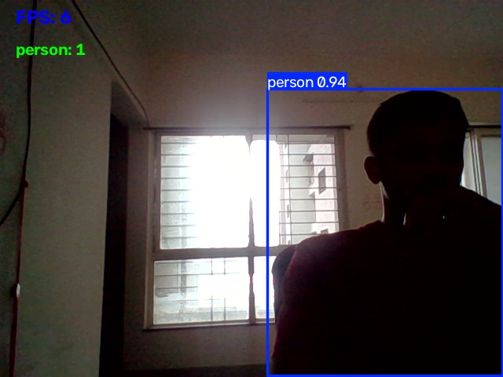

# YOLOv8 Real-Time Object Detection

A real-time computer vision application that uses YOLOv8 and OpenCV to detect and count objects through a webcam.

## 🚀 Features

- Real-time object detection
- YOLOv8 deep learning model
- Webcam integration using OpenCV
- Bounding box visualization
- Object confidence scores
- Live object counting
- FPS (Frames Per Second) counter
- Screenshot capture
- Detection video recording

## 🛠️ Technologies Used

- Python
- YOLOv8
- Ultralytics
- OpenCV
- Computer Vision
- Deep Learning

## 📂 Project Structure

```text
YOLOv8-Object-Detection/
│
├── main.py
├── requirements.txt
├── README.md
├── .gitignore
│
├── assets/
│   └── project-screenshot.jpg
│
└── output/
    ├── screenshots/
    └── demo.avi

    ⚙️ Installation

### 1. Clone the repository

git clone https://github.com/9922661211/YOLOv8-Real-Time-Object-Detection.git
cd YOLOv8-Real-Time-Object-Detection

    2. create a virtual environment 
     python -m venv .venv

     3. Install dependencies
.venv\Scripts\python.exe -m pip install -r requirements.txt

 4. Run the project
.venv\Scripts\python.exe main.py

## 🧠 How It Works

1. OpenCV captures live video from the webcam.
2. YOLOv8 processes each video frame.
3. The model detects objects in the frame.
4. Bounding boxes and confidence scores are displayed.
5. Detected objects are counted.
6. FPS is displayed on the screen.
7. Press `S` to save a screenshot.
8. The processed video can also be recorded.

## 📸 Screenshot



## 🚀 Future Improvements

- Object tracking
- Custom-trained YOLO model
- Threat detection
- Multiple camera support
- Web-based dashboard
- Alert and notification system
- GPU acceleration

## 👨‍💻 Author

**Hamzah Sayyed**

Computer Engineering Student | AI/ML & Computer Vision Enthusiast